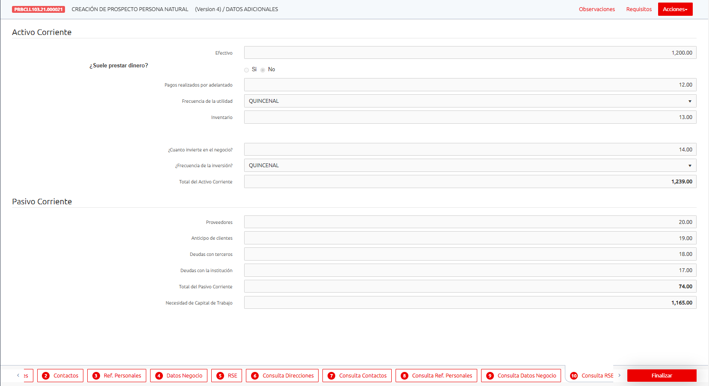

<h1 style="text-align:center">Santander Perú</h1>

## Technologies

 

  

    

En este proyecto mi tarea consistía en construir interfaces de usuario y lógica de negocio para las operaciones de clientes. Pantallas como Creación y Actualización y Información adicional como Direcciones, Contactos, Negocios, Análisis de Negocio, Referencias y Contactos.

Estas funcionalidades deberían funcionar de forma dinámica desde el "Flujo", otra funcionalidad desarrollada que consiste en agregar navegabilidad entre formularios como si fueran pasos y estos flujos se creaban en base a BPMN que fue integrado con este funcionalidad.

In this project my task was to build the UI and the Bussiness Logic for the Client Operations. Screens such as Creation, Updating and Additional Information Such as Address, Contacts, Bussiness, Bussiness Analysis, References and Contacts

This functionalities should work dynamically from the "Flux", another functionality developed that consist in add navigation between forms as if they were steps and this fluxes where created from a BPMN manager that was integrated with this functionality.

### Creación de Prospectos - Personas Naturales

### Datos Sensibles - Actualización

### Direcciones

### Contactos

### Referencias Personales

### Datos de Negocio

### Análisis de Negocio

